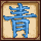

# Aomoji Vanity  <!--  -->

> Monolithic repository for Aomoji Vanity and related projects.

This repository is home to _Aomoji Vanity_, a Terraria content mod focused primarily around vanity items, as well as additional projects used to aid in development or add on to the original mod.

## Aomoji Vanity

_Aomoji Vanity_ (referred to hereinafter as simply _Aomoji_) is a content mod for [Terraria](https://terraria.org) that runs on the [tModLoader](https://github.com/tModLoader/tModLoader) modding API. While not strictly *just* a vanity mod, much of its content—both added and planned—is unintrusive vanity content. Gameplay-altering content is added—both as items/NPCs/etc. and mechanic reworks—but is only optional and can be configured in singleplayer and in multiplayer by the server host.

### API

Very rarely, Aomoji may expose certain features through an API (located in the base `AomojiVanity.API` namespace) for other mods to use if they so desire (note that this requires a dependency on Aomoji).

Generally, we try to instead expose these APIs through pull requests to tModLoader (as was done with [our `ModHair` API](https://github.com/tModLoader/tModLoader/pull/3433)[^1]) or through separate library/API mods.

## `AomojiCommonLibs`

Useful programmatic modding utilities; a separate library mod.

## `AomojiResourcePacks`

A modded resource pack API that Aomoji Vanity uses.

## `AomojiVanity.Build`

Our build toolchain, `AomojiVanity.Build`, is a simplistic set of MSBuild `.targets` files modeled after several other projects of mine, and is a temporary solution for convenient custom mod paths, cross-platform- and non-Visual Studio-supported game launching/debugging, and more. See [steviegt6/collate](https://github.com/steviegt6/collate) for its eventual successor.

[^1]: In which I solved gender inequality and the gender identity debate.
